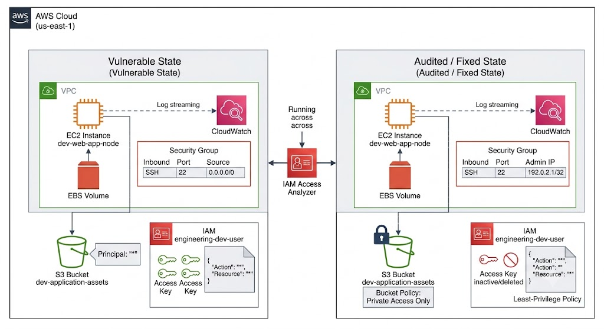
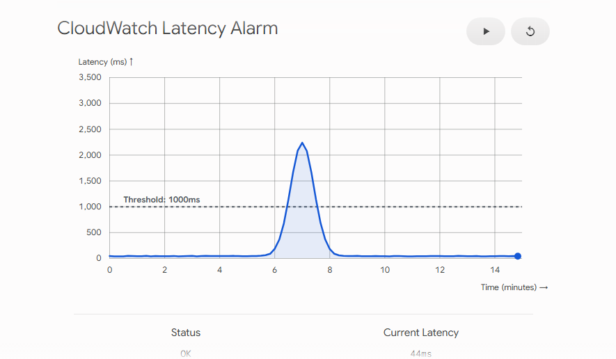
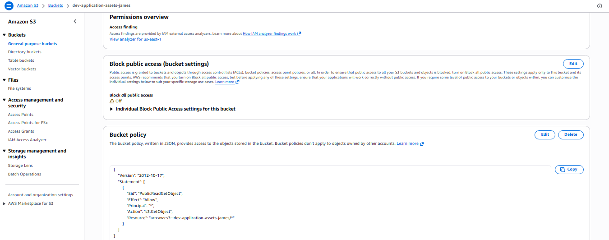
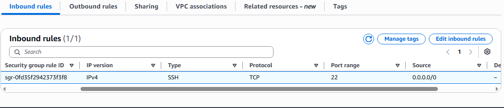
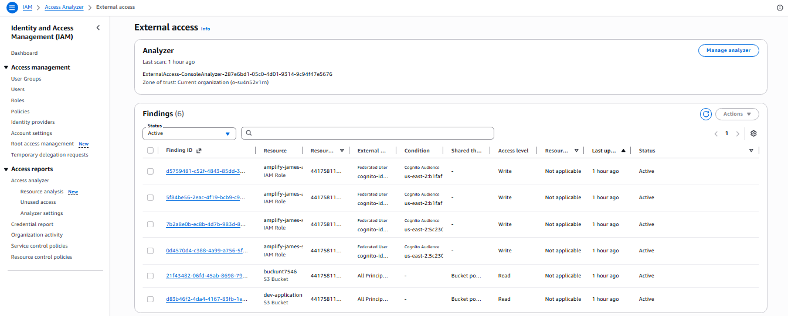
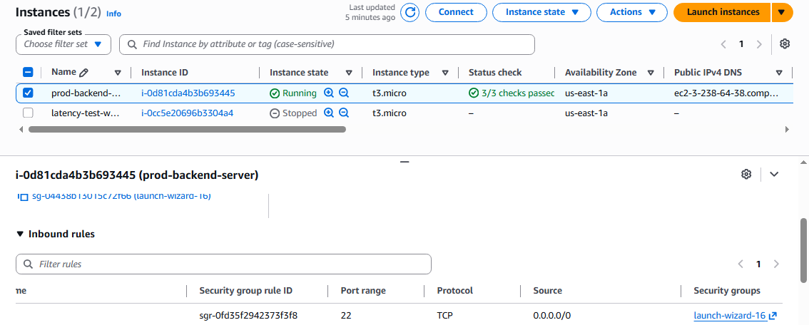
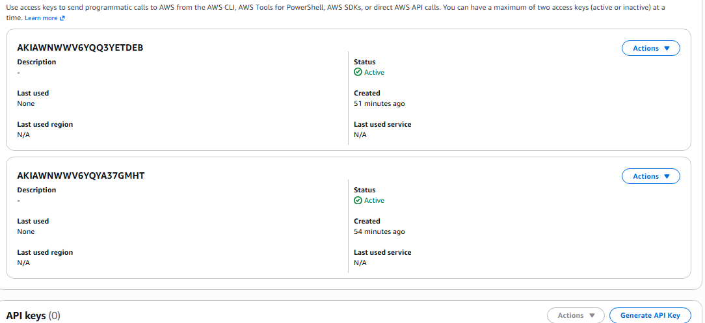
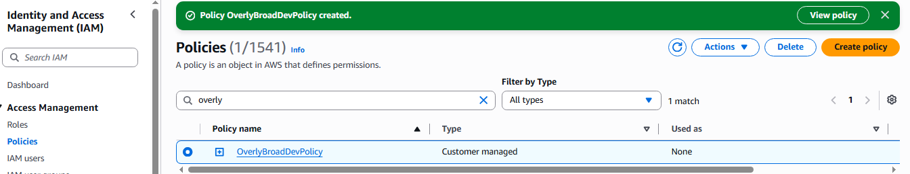

# aws-secure-cloud-infrastructure
AWS cloud infrastructure lab focusing on security engineering, infrastructure auditing, identity access management (IAM) risk mitigation, and automated vulnerability detection.

# Identifying, Auditing, and Remediating Security Risks in AWS Infrastructure

## 📌 Project Overview
This project simulates an enterprise-grade cloud engineering lifecycle: transitioning a secure development environment into a vulnerable state to model real-world risks, acting as an independent Security Auditor to detect and document those flaws, and executing an industry-standard remediation plan. It also demonstrates proactive operational monitoring and cost optimization practices aligned with the AWS Well-Architected Framework.

### 🛠️ Services Utilized
*   **Compute:** Amazon EC2, Amazon EBS
*   **Storage:** Amazon S3
*   **Identity & Governance:** AWS IAM, IAM Access Analyzer
*   **Monitoring & Observability:** Amazon CloudWatch, CloudWatch Logs Agent

---

## 🗺️ Architecture Blueprint
The diagram below illustrates the dual-state infrastructure configuration modeled during this project, showcasing the progression from intentional vulnerabilities to audited and secure baselines.

  
  
<i>Figure 0: Comprehensive Project Architecture Blueprint showing Vulnerable vs. Remediated States.</i>

---

## 🚀 Phase 1: Environment Baseline & Monitoring Setup
To establish an operational baseline, a secure virtual server (`prod-backend-...`) was provisioned within `us-east-1a`. To track environment assets and identity control, a dedicated IAM user (`engineering-dev-user`) and a storage bucket (`dev-application-assets-james`) were established.

  

<i>Figure 1: Successful deployment of the production backend EC2 instance in us-east-1a.</i>

  

<i>Figure 2: IAM Management Console showing the newly provisioned engineering-dev-user.</i>

  

<i>Figure 3: Amazon S3 dashboard confirming creation of the target asset bucket.</i>

  

<i>Figure 4: Initial user permission state with attached administrative and standard read-only policies.</i>

### 🚨 Operational Incident Simulation
A CloudWatch metric alarm was implemented to track backend application stability. To test monitoring reliability and incident response mechanisms, an operational failure was intentionally triggered by executing a `pkill gunicorn` command on the backend web server process, causing an intentional alarm breach due to a sudden performance and latency spike.

  
  
<i>Figure 4b: CloudWatch Metric Graph illustrating the application latency spike and alarm breach during simulated server failure.</i>

---

## 💥 Phase 2: Simulating Production Security Risks
To simulate common configuration drift and developer mistakes found in enterprise cloud deployments, five distinct security flaws were intentionally engineered into the environment:

1.  **S3 Data Exposure:** The bucket policy for `dev-application-assets` was altered to grant anonymous global access (`"Principal": "*"`).
2.  **Network Exposure:** The EC2 Security Group rules were expanded from a single trusted IP to allow inbound SSH traffic from anywhere on the internet (`0.0.0.0/0`).
3.  **Identity Risk (Credential Sprawl):** Multiple active, unmonitored AWS programmatic Access Keys were generated for a single identity, duplicating the attack surface for credential leaks.
4.  **Identity Risk (Wildcard Policy):** A custom IAM policy (`OverlyBroadDevPolicy`) was applied containing full administrative capabilities (`"Action": "*", "Resource": "*"`).

  
  
<i>Figure 5: Bucket policy open to global anonymous traffic.</i>

  
  
<i>Figure 6: Firewall rules modified to expose Port 22 to the public internet.</i>

---

## 🔍 Phase 3: The Security Review & Configuration Audit
Switching to an independent Security Auditor persona, automated governance tools and manual inspection methods were deployed to discover and categorize the vulnerabilities created in Phase 2.

### 🤖 Automated Analysis (AWS IAM Access Analyzer)
AWS IAM Access Analyzer was activated to mathematically evaluate resource permissions across the zone. The analyzer successfully scanned the environment, surfacing immediate, high-severity findings regarding the publicly exposed storage infrastructure.

  
  
<i>Figure 7: Automated Access Analyzer findings highlighting public resource exposures.</i>

### 🕵️‍♂️ Manual Forensic Collection
Compiling forensic proof for a formal security assessment report requires verifying live production risk states directly from the control plane:

  
  
<i>Figure 8: Forensic audit confirming unmitigated SSH access from 0.0.0.0/0 on the active instance.</i>

  
  
<i>Figure 9: Verification of multiple active, unused AWS Access Keys linked to a single developer identity.</i>

  
  
<i>Figure 10: JSON view of the dangerous wildcard policy highlighting AWS native policy warning indicators.</i>

---

## ⚠️ Bottlenecks, Edge Cases & Operational Pitfalls

### 1. CloudWatch Log Agent Log-Buffering Latency
The CloudWatch log agent operates on a batching and polling cycle regulated by parameters like `buffer_duration`. In high-throughput production workloads, a sudden surge in log generation can result in processing delays or spike localized CPU consumption on the EC2 host. Production deployments require configuring explicit file rotation settings (`logrotate`) to protect disk capacity from filling up during streaming bottlenecks.

### 2. IAM Access Analyzer Consistency Windows
Access Analyzer scans resource-based parameters continuously; however, a slight propagation delay exists between a user saving an insecure policy and the finding manifesting on the centralized dashboard. Security operations shouldn't rely solely on asynchronous scanning; they must integrate inline pre-commit validations or CI/CD linting rules to block misconfigurations before deployment.

### 3. Account-Level S3 Block Public Access Constraints
If an AWS account has the global *S3 Block Public Access* feature enabled at the account level, individual bucket policies containing an anonymous public `"Principal": "*"` string will be overridden and neutralized by default. Simulating this risk realistically required explicitly disabling the account-level safety guardrail first—underlining how crucial centralized cloud governance controls are for distributed engineering operations.

---

## 💰 Phase 4: Cost Optimization & Resource Lifecycle
To conform with the Cost Optimization pillar of the AWS Well-Architected Framework, a strict resource-reclamation workflow was executed to clean up trailing assets, prevent "zombie resource" charges, and control cloud budget creep:

*   **Compute Demobilization:** Idle EC2 virtual servers were terminated cleanly, immediately stopping compute runtime hourly billing.
*   **Storage Reclamation:** Associated EBS block storage volumes were detached and deleted to eliminate persistent per-GB monthly storage fees. The target S3 bucket was fully purged and deleted, ensuring zero lingering data costs.
*   **Identity Hygiene:** The unmonitored duplicate Access Keys and broad IAM policy bindings were fully decommissioned to reduce administrative overhead and tracking sprawl.
